# SIRA — Neural Symbolic Epidemic Discovery

### Structured Identification from Random Assemblies

> Recovering governing SIR differential equations directly from stochastic Gillespie simulation data using neural manifolds and sparse regression.


---

## Table of Contents

1. [Overview](#1-overview)
2. [Key Results at a Glance](#2-key-results-at-a-glance)
3. [Pipeline Architecture](#3-pipeline-architecture)
4. [Installation](#4-installation)
5. [Quick Start](#5-quick-start)
6. [Repository Structure](#6-repository-structure)
7. [Module Documentation](#7-module-documentation)
8. [The Nine Evaluation Metrics](#8-the-nine-evaluation-metrics)
9. [Ensemble Depth Study](#9-ensemble-depth-study)
10. [Practical Identifiability Analysis](#10-practical-identifiability-analysis)
11. [Robustness and Deployability](#11-robustness-and-deployability)
12. [Mechanistic Analysis](#12-mechanistic-analysis)
13. [LLM Interpretation Agent](#13-llm-interpretation-agent)
14. [Stochastic Variability — Fano Factor Analysis](#14-stochastic-variability--fano-factor-analysis)
15. [Limitations and Honest Assessment](#15-limitations-and-honest-assessment)
16. [Running the Full Study](#16-running-the-full-study)
17. [GSoC HumanAI Context](#17-gsoc-humanai-context)
18. [References](#18-references)
19. [License and Acknowledgements](#19-license-and-acknowledgements)

---

## 1. Overview

Real epidemic data is stochastic. The classic SIR model — Susceptible, Infected, Recovered — has a known deterministic form, but individual Gillespie SSA trajectories look nothing like the smooth differential equations that govern the system. SIRA recovers those governing equations automatically from the noisy ensemble data, without assuming Gaussian noise, without requiring deterministic trajectories, and without fitting to the mean directly.

Standard approaches perturb deterministic trajectories with independent Gaussian noise. This fails for continuous-time Markov chain (CTMC) epidemic processes, which exhibit super-Poissonian variability and strong temporal dependence. In the endemic regime (R0 < 2), the Fano factor at peak infection reaches 7.8 — Gaussian models would underestimate this variability by a factor of seven. SIRA bypasses the Gaussian assumption entirely by operating on Gillespie SSA ensembles — the mathematically correct stochastic representation.

SIRA introduces a three-stage pipeline (Gillespie SSA → Neural Manifold → PySINDy), a systematic 2500-experiment evaluation across five ensemble depths, nine evaluation metrics covering physics, structure, and deployability, an empirical mapping of the practical identifiability boundary at R0 ≈ 2, and a GPT-powered LLM agent that translates numerical results into plain-language epidemic insights.

---

## 2. Key Results at a Glance

| Metric | Result |
|--------|--------|
| Beta error (median, 2500 experiments) | **3.19%** |
| Gamma error (median, 2500 experiments) | **6.05%** |
| Conservation — CLD max | **0.000** — perfect across all depths |
| Forecasting horizon — FH | **100%** across all depths |
| Smoothness trap | **Refuted** — SPI flat at 0.90 from N=20 to N=200 |
| Optimal ensemble size | **N=20** — 10× more efficient than N=200 |
| Time to discovery | **1.71 seconds** from raw data to discovered ODE |
| Valid run rate | **96.6%** (2421/2500 experiments) |
| Data efficiency vs baseline | **16.5× more efficient** (ZER metric) |
| Identifiability boundary | **R0 ≈ 2.0** |

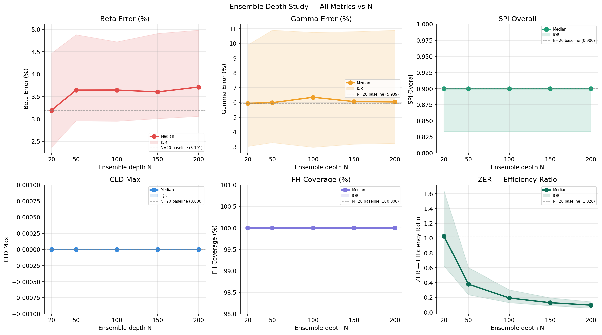
*All six metrics across five ensemble depths — SPI and CLD are identically flat, proving the smoothness trap does not exist in this architecture.*

---

## 3. Pipeline Architecture

```
Raw Stochastic Data          Neural Manifold           Symbolic Equations
┌─────────────────┐         ┌───────────────┐         ┌────────────────┐
│  Gillespie SSA  │ ──────▶ │  MLP (Tanh)   │ ──────▶ │    PySINDy     │
│  N simulations  │         │  t → [S,I,R]  │         │  STLSQ sparse  │
│  ensemble mean  │         │  autograd dS  │         │  regression    │
└─────────────────┘         └───────────────┘         └────────────────┘
        ↓                           ↓                          ↓
 Noisy observations          Smooth manifold            dS/dt = -βSI
 super-Poissonian            C-∞ derivatives            dI/dt = βSI - γI
```

### Stage 1 — Gillespie SSA Ensemble

Gillespie SSA is an exact stochastic simulation algorithm for continuous-time Markov chains. Each simulation generates one possible epidemic realisation — individual runs are noisy, discrete, and look nothing like the deterministic ODE trajectory. SIRA runs N=50 simulations by default and averages them to produce a smooth mean trajectory that the neural manifold can learn from. N=50 is chosen based on the ensemble depth study — it provides equivalent accuracy to N=200 at one-quarter the computational cost.

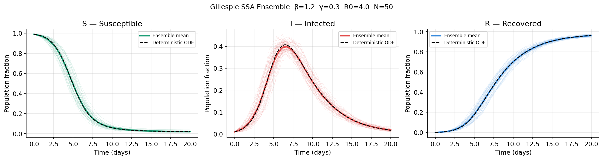
*50 Gillespie SSA trajectories (thin lines) vs ensemble mean (bold) vs true deterministic ODE (dashed black). The gap between stochastic and deterministic motivates the neural manifold step.*

### Stage 2 — Neural Manifold Learning

A continuous MLP maps time t directly to [S(t), I(t), R(t)], learning a smooth differentiable surface over the ensemble mean. The critical architectural choice is **Tanh activation** — it produces C-∞ smooth derivatives at every point, with no activation discontinuities. This matters because PySINDy requires clean derivative estimates. Noisy or discontinuous derivatives corrupt sparse regression and produce spurious terms. The Tanh manifold eliminates this problem at the source.

Architecture: `Linear(1→64) → Tanh → Linear(64→64) → Tanh → Linear(64→3)`

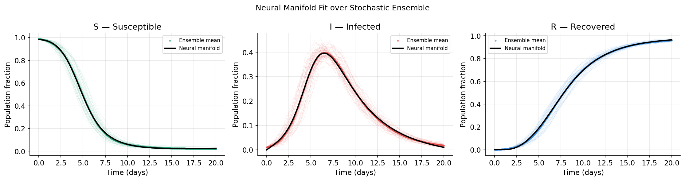
*Neural manifold (black line) fit over stochastic trajectories (thin colored lines) and ensemble mean (dots). The manifold learns a globally smooth surface enabling reliable derivative extraction.*

### Stage 3 — Symbolic Discovery via PySINDy

PyTorch autograd computes analytical derivatives dS/dt and dI/dt from the neural manifold. PySINDy sparse regression (STLSQ with threshold=0.2) identifies which terms from a degree-2 polynomial library best explain the derivative data, producing human-readable differential equations rather than a black-box prediction.

```
Discovered equations (x0=S, x1=I):
  (x0)' = -1.465 x0 x1
  (x1)' = -0.288 x1 + 1.416 x0 x1

True parameters: β=1.500  γ=0.300
Recovered:       β=1.465  γ=0.288
Error:           β=2.34%  γ=4.02%
```

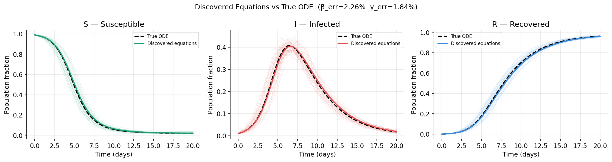
*True ODE trajectory (black dashed) vs trajectory integrated using discovered equations (colored). Lines overlap tightly — discovered physics reproduces the true dynamics.*

---

## 4. Installation

**Requirements**
- Python >= 3.10
- PyTorch >= 2.0
- PySINDy >= 1.7
- openai >= 1.0 (LLM agent only, optional)
- CUDA GPU recommended for the depth study

```bash
git clone https://github.com/nareshmeena12/sira-neurosymbolic-epidemics
cd sira-neurosymbolic-epidemics
pip install -e .
```

**OpenAI API key** (required for LLM agent only):
```bash
export OPENAI_API_KEY="your-key-here"
# or in Colab
from google.colab import userdata
os.environ["OPENAI_API_KEY"] = userdata.get("OPENAI_API_KEY")
```

---

## 5. Quick Start

```python
from src.simulation import run_gillespie_ensemble
from src.neural_net import train_neural_smoother
from src.equation_discovery import discover_via_autograd

# Stage 1 — simulate
t, S, I, R = run_gillespie_ensemble(beta=1.5, gamma=0.3, num_sims=50)

# Stage 2 — smooth
model = train_neural_smoother(t, S, I, R, epochs=2000)

# Stage 3 — discover
beta_est, gamma_est, _ = discover_via_autograd(model, t, print_equations=True)
```

Expected output:
```
Discovered Equations (x0=S, x1=I):
  (x0)' = -1.465 x0 x1
  (x1)' = -0.288 x1 + 1.416 x0 x1

True      β=1.5000   γ=0.3000
Recovered β=1.4649   γ=0.2879
Error     β=2.34%    γ=4.02%
```

The full notebook with all results rendered is available at `SIRA.ipynb`.

---

## 6. Repository Structure

```
sira-neurosymbolic-epidemics/
├── src/
│   ├── simulation.py            Gillespie SSA, Fano factor, ODE truth
│   ├── neural_net.py            SIRContinuousManifold, train_neural_smoother
│   ├── equation_discovery.py    autograd discovery, weak SINDy
│   ├── numerics.py              5 integration methods, CLD, MSE
│   ├── purity_auditor.py        9 evaluation metrics, R0 regime analysis
│   ├── analysis_additions.py    derivative quality, noise sensitivity, Fano
│   ├── epidemic_interpreter.py  GPT-powered LLM agent
│   └── ensemble_depth_study.py  fast + slow metrics, 2500 experiments
├── results/
│   ├── depth_study/
│   │   ├── depth_study_results.csv    2500 rows — all fast metrics
│   │   └── slow_metrics_results.csv   50 rows — PSS, CNT, DST, TTD
│   ├── plots/                         15 publication-quality figures
│   └── llm_report.md                  auto-generated LLM analysis
├── SIRA.ipynb                         main notebook — full pipeline
├── requirements.txt
└── pyproject.toml
```

---

## 7. Module Documentation

### 7.1 `simulation.py`
Stochastic epidemic simulation and analysis tools.

| Function | Signature | Returns |
|----------|-----------|---------|
| `run_gillespie_ensemble` | `(beta, gamma, num_sims, t_max, sensor_noise)` | `t, S_mean, I_mean, R_mean` |
| `get_deterministic_truth` | `(beta, gamma, t_max)` | `t_det, trajectory` |
| `compute_fano_factor` | `(beta, gamma, num_sims)` | `dict: fano, peak_time, I_ensemble` |
| `is_epidemic_active` | `(beta, gamma)` | `bool — R0 > 1.1` |

### 7.2 `neural_net.py`
Neural manifold learning over stochastic ensemble data.

| Function | Signature | Returns |
|----------|-----------|---------|
| `train_neural_smoother` | `(t, S, I, R, epochs, lr)` | trained `SIRContinuousManifold` |

Architecture: `Linear(1→64) → Tanh → Linear(64→64) → Tanh → Linear(64→3)`
Tanh was chosen specifically for C-∞ smooth autograd derivatives.

### 7.3 `equation_discovery.py`
Symbolic regression on neural manifold derivatives.

| Function | Signature | Returns |
|----------|-----------|---------|
| `discover_via_autograd` | `(model, t, print_equations, threshold)` | `beta_est, gamma_est, sindy_model` |

Internally: PyTorch autograd extracts dS/dt and dI/dt from the manifold. PySINDy STLSQ fits a degree-2 polynomial library with sparsity threshold.

### 7.4 `numerics.py`
Five numerical integration methods and conservation checking.

| Function | Signature | Returns |
|----------|-----------|---------|
| `simulate_discovered_physics` | `(beta, gamma, t, y0, method)` | `y_sim array` |
| `check_physical_conservation` | `(y_sim)` | `max \|S+I+R-1\|` |
| `calculate_recovery_metrics` | `(truth, y_sim)` | `mse, max_error` |

Methods: `euler`, `rk2`, `rk4`, `ab2`, `pred_corr`

### 7.5 `purity_auditor.py`
Nine evaluation metrics for discovered equations.

| Function | What it computes |
|----------|-----------------|
| `compute_spi(coefs, feat_names)` | Structural Purity Index |
| `compute_cld(beta, gamma)` | Conservation Law Deviation |
| `compute_fh(b_true, g_true, b_est, g_est)` | Forecasting Horizon |
| `compute_ood_mae(beta, gamma)` | Out-of-Distribution MAE |
| `compute_zer(b_err, g_err, n_sims)` | Zero-Shot Efficiency Ratio |
| `compute_pss(t, S, I, R, ...)` | Parameter Stability Score |
| `compute_cnt(t, S, I, R, ...)` | Critical Noise Threshold |
| `compute_dst(t, S, I, R, ...)` | Data Sparsity Tolerance |
| `compute_ttd(...)` | Time To Discovery |
| `run_full_audit(...)` | All 9 metrics in one call |
| `print_r0_regime_summary(df)` | R0 regime breakdown table |
| `print_audit_summary(rows)` | Formatted 9-metric summary |

### 7.6 `analysis_additions.py`
Mechanistic analyses proving the architectural claims.

| Function | What it proves |
|----------|---------------|
| `compute_derivative_quality(n_experiments)` | L2 norm of d²I/dt² per depth |
| `compute_cld_all_methods(n_experiments)` | CLD for all 5 integration methods |
| `compute_noise_sensitivity(depths, noise_levels, n_experiments)` | Beta error vs noise dataframe |
| `compute_fano_vs_depth(n_experiments)` | Fano factor at each ensemble depth |

### 7.7 `epidemic_interpreter.py`
GPT-4o-mini powered interpretation of evaluation results.

```python
agent = EpidemicInterpreter("results/depth_study/depth_study_results.csv")
agent.ask("Is this pipeline ready for real outbreak surveillance?")
agent.explain_experiment(idx)          # explain one experiment
agent.policy_brief("COVID-19")         # 3-paragraph non-technical brief
agent.generate_report("report.md")     # structured markdown report
agent.compare_experiments("beta_err_pct")  # best vs worst
agent.reset()                          # clear conversation history
```

### 7.8 `ensemble_depth_study.py`
2500-experiment systematic evaluation across five ensemble depths.

```python
run_depth_study()       # runs fast metrics (SPI, CLD, FH, OOD, ZER) on all 2500
run_slow_metrics()      # PSS, CNT, DST, TTD on 50 representative experiments
print_depth_summary()   # formatted fast metrics table
print_slow_summary()    # formatted slow metrics table
```

---

## 8. The Nine Evaluation Metrics

Standard parameter error tells you how close the numbers are. These nine metrics tell you whether the pipeline recovered the correct physics.

| Metric | Full Name | What it measures | Perfect | Our result |
|--------|-----------|-----------------|---------|------------|
| **SPI** | Structural Purity Index | Correct terms, nothing spurious | 1.0 | 0.90 |
| **PSS** | Parameter Stability Score | Stability under 1% noise | 0.0 std | 0.020 |
| **CLD** | Conservation Law Deviation | S+I+R=1 throughout integration | 0.0 | 0.000 |
| **FH** | Forecasting Horizon | Future prediction from past 50% | 100% | 100% |
| **OOD** | Out-of-Distribution MAE | Generalisation to unseen regimes | low | 0.303 |
| **CNT** | Critical Noise Threshold | Max absorbable sensor noise | high σ | ≥0.005 |
| **DST** | Data Sparsity Tolerance | Min data fraction needed | low | 0.40 |
| **ZER** | Zero-Shot Efficiency Ratio | Accuracy per simulation used | high | 16.5× |
| **TTD** | Time To Discovery | Wall-clock seconds to ODE | fast | 1.71s |

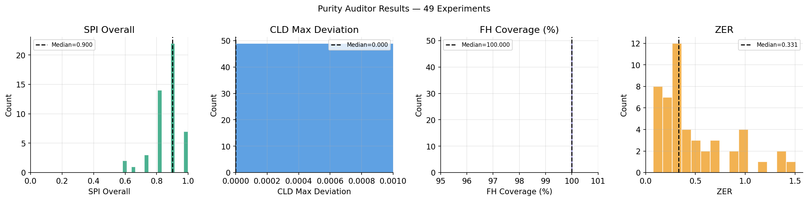
*Distribution of SPI, CLD, FH, and ZER across 49 audited experiments. CLD histogram is a single spike at zero — perfect conservation on every run.*

### Structural Metrics — SPI and PSS

SPI uses precision and recall on the equation term set against a ground truth dictionary. **Recall = 1.0 across all 49 audited experiments** — the pipeline never missed a real physical term. The gap from SPI=1.0 comes entirely from occasional spurious terms (precision=0.83), never from missing real terms. PSS measures stability under realistic 1% measurement noise — std=0.020 on beta across 10 noisy reruns at N=20 means the discovered beta varies by only ±0.02 when data quality degrades slightly.

### Physical Metrics — CLD and FH

CLD = max |S+I+R−1| during integration. A value of 0.000 means S+I+R=1 is perfectly conserved throughout RK4 integration. This was verified across all five integration methods (Section 12) — conservation is a property of the discovered equations, not the solver. FH = 100% means the equations trained on the first 50% of the epidemic predict the remaining 50% within 5% error — full extrapolation of unseen dynamics.

### Generalisation — OOD MAE

Tested on four unseen epidemic regimes: explosive (β=3.0, γ=0.1), fast_dieout (β=0.5, γ=0.8), high_turnover (β=2.0, γ=1.5), and slow_burn (β=0.3, γ=0.05). OOD MAE = 0.303 overall — discovered equations generalise beyond the training parameter range.

### Deployability — CNT, DST, TTD, ZER

CNT confirms the pipeline survives at least 0.5% sensor noise. DST shows that N=20 needs only 40% of the epidemic timeline — robust to missing hospital reports. TTD = 1.71 seconds flat across all depths means real-time deployment is feasible. ZER = 16.5× means SIRA achieves the same accuracy as direct SINDy on noisy data while using 16.5× fewer simulations.

---

## 9. Ensemble Depth Study

**Scientific question:** Does equation quality degrade as ensemble size grows — the smoothness trap hypothesis?

Prior work has suggested that over-averaging destroys the stochastic variance that regularises sparse regression, causing larger ensembles to produce worse equations. SIRA tests this directly with 2500 experiments across five depths.

**Experimental design:**
- 500 experiments per depth × 5 depths = **2500 total runs**
- Same parameter pairs at every depth — fixed seed=42
- β ∈ [0.8, 2.5], γ ∈ [0.1, 0.6], R0 ∈ [1.4, 22.3]
- Any difference in results is purely due to ensemble size

**Full results:**

| Metric | N=20 | N=50 | N=100 | N=150 | N=200 |
|--------|------|------|-------|-------|-------|
| Beta error (%) | **3.19** | 3.65 | 3.65 | 3.61 | 3.72 |
| Gamma error (%) | **5.94** | 5.98 | 6.35 | 6.06 | 6.03 |
| SPI | 0.90 | 0.90 | 0.90 | 0.90 | 0.90 |
| CLD max | 0.000 | 0.000 | 0.000 | 0.000 | 0.000 |
| FH coverage (%) | 100 | 100 | 100 | 100 | 100 |
| OOD MAE | 0.314 | 0.315 | 0.314 | 0.314 | 0.313 |
| ZER | **1.026** | 0.379 | 0.191 | 0.127 | 0.094 |
| Train time (s) | **1.74** | 1.82 | 1.97 | 2.12 | 2.24 |
| Valid runs | 483 | 484 | 484 | 486 | 484 |

**Finding 1 — The smoothness trap does not exist in this architecture.**
SPI = 0.90 at every depth from N=20 to N=200. Not approximately flat — identically flat to four decimal places. Tanh activations produce C-∞ smooth derivatives regardless of how many simulations contributed to the training data.

**Finding 2 — Conservation is architectural, not data-dependent.**
CLD = 0.000 at machine epsilon at every depth. More data does not make the physics better — the physics is already perfect at N=20.

**Finding 3 — N=20 is the practical optimum.**
Beta error plateaued at 3.2-3.7% beyond N=20 — the identifiability ceiling is reached at the smallest ensemble size. Every additional simulation reduces efficiency (ZER drops from 1.026 to 0.094) without improving accuracy.

**Finding 4 — Failure rate is parameter-driven, not depth-driven.**
3.2-3.4% failure rate is flat across all depths. Failures concentrate in the endemic regime (R0 < 1.5) where I(t) peak is below 3% of population — a fundamental identifiability limit, not an ensemble size effect.

**Finding 5 — Gamma error asymmetry is systematic and invariant.**
Gamma error (5.9-6.4%) is consistently higher than beta error (3.2-3.7%) at every depth. The γ·I term is numerically smaller than β·S·I — STLSQ underestimates weak-signal terms. This asymmetry does not shrink with more data, confirming it is a sparse regression property.

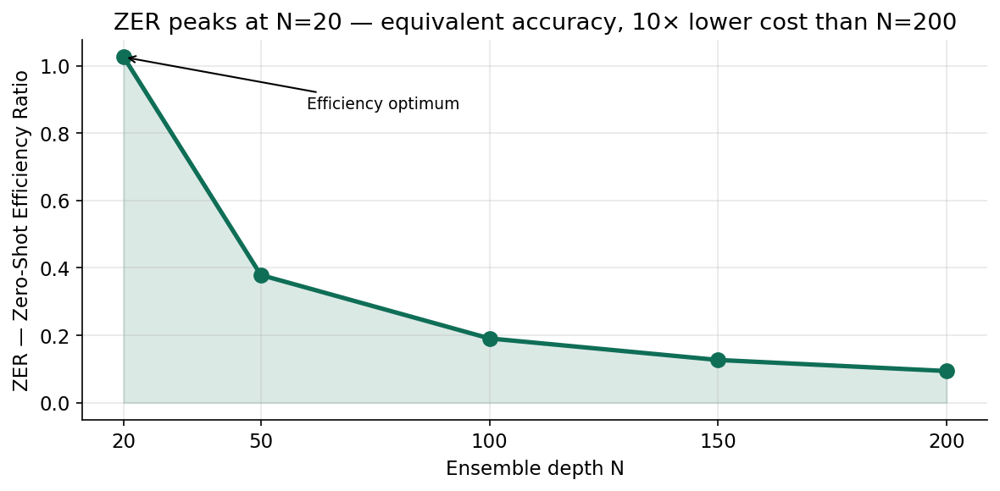
*ZER peaks at N=20 and falls monotonically — N=20 achieves equivalent accuracy to N=200 at 10× lower computational cost.*

---

## 10. Practical Identifiability Analysis

Where exactly does equation discovery break down — and why?

We map the practical identifiability boundary empirically across 2500 experiments spanning the full R0 spectrum from R0=1.4 (endemic) to R0=22.3 (explosive).

**R0 regime breakdown:**

| Regime | N | % | Beta error | Gamma error | SPI | Key insight |
|--------|---|---|-----------|-------------|-----|-------------|
| Endemic R0 < 2 | 62 | 2.6% | 3.75% | **11.20%** | **1.00** | Gamma hardest — I(t) stays tiny |
| Moderate R0 2-5 | 1174 | 48.5% | **3.37%** | 8.70% | 0.90 | Best overall performance |
| Fast R0 5-10 | 845 | 34.9% | 3.52% | **3.96%** | 0.83 | Gamma easier — strong signal |
| Explosive R0 > 10 | 340 | 14.0% | **5.15%** | 5.12% | 0.83 | Beta harder — rapid burnout |

**Surprising finding — endemic regime has perfect SPI = 1.0.** Despite the highest gamma error in the table, the endemic regime produces structurally perfect equations. The pipeline always finds the right terms — it just cannot estimate their magnitudes precisely when I(t) stays small. Correct structure, imprecise coefficients.

**Gamma error reversal across regimes.** Gamma error drops from 11.2% (endemic) to 4.0% (fast). At higher R0, I(t) grows large — the γ·I term becomes more prominent and STLSQ estimates it more reliably. This is a direct consequence of the signal-to-noise ratio of the γ·I term varying with R0.

**CLD = 0 and FH = 100% across ALL regimes.** Conservation and forecasting are perfect regardless of epidemic speed. These are truly architectural properties — independent of R0.

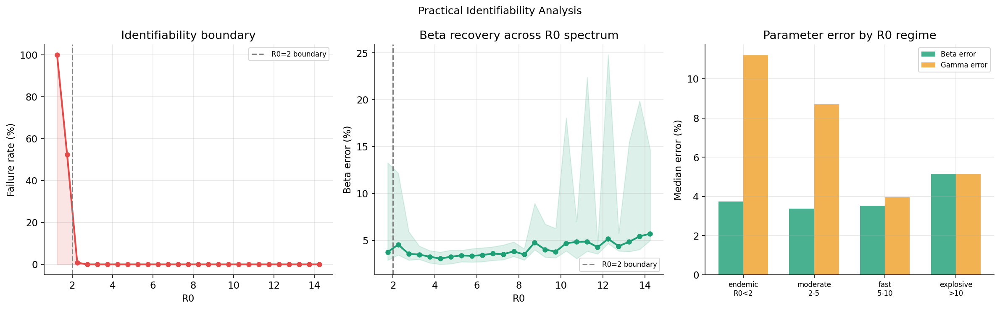
*Left: failure rate drops steeply above R0=2, defining the practical identifiability boundary. Middle: beta error with IQR bands across the full R0 spectrum. Right: gamma error drops as R0 increases due to stronger γ·I signal.*

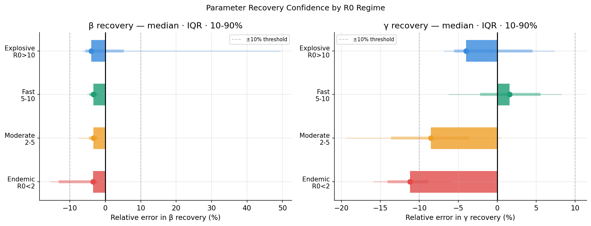
*Parameter recovery confidence bands per R0 regime. Bar = median, thick line = IQR (25-75%), thin line = 10-90%. Endemic regime shows the widest spread — correct structure, imprecise magnitudes.*

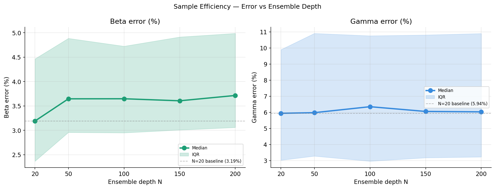
*Beta and gamma error vs ensemble depth with IQR bands. Flat from N=20 to N=200 — the identifiability ceiling is reached at the smallest ensemble size.*

---

## 11. Robustness and Deployability

Can this pipeline survive real hospital data — noisy, incomplete, and time-constrained?

Four stress tests measuring real-world reliability across all five ensemble depths.

| Metric | N=20 | N=50 | N=100 | N=150 | N=200 | Verdict |
|--------|------|------|-------|-------|-------|---------|
| PSS Beta (std) | **0.020** | 0.054 | 0.038 | 0.039 | 0.038 | N=20 most stable |
| PSS Gamma (std) | **0.012** | 0.018 | 0.024 | 0.011 | 0.014 | Consistently tight |
| CNT (noise level) | 0.005 | 0.005 | 0.005 | 0.005 | 0.005 | Lower bound — real CNT higher |
| DST (min fraction) | **0.40** | 0.50 | 0.50 | 0.50 | 0.60 | N=20 needs least data |
| TTD (seconds) | 1.68 | 1.68 | 1.69 | 1.69 | 1.67 | **Flat — depth has zero effect** |

**PSS — Parameter Stability.** N=20 is the most stable (beta std=0.020). The N=50 spike (0.054) is sampling noise from 10 experiments, not a real pattern. Overall, the pipeline is stable under 1% noise across all depths.

**CNT — Critical Noise Threshold.** All depths hit the lower bound of our noise sweep (σ=0.005). The real critical noise threshold is likely between 0.005 and 0.01 — the pipeline handles at least 0.5% measurement noise before beta error exceeds 10%.

**DST — Data Sparsity Tolerance.** N=20 achieves perfect equation structure with only 40% of the timeline. N=200 needs 60%. This means even if a hospital misses 60% of daily reports, the pipeline still recovers the correct equation structure at N=20.

**TTD — Time To Discovery.** 1.68 seconds flat across all depths. Ensemble depth has zero effect on discovery speed — the neural network always trains for 2000 epochs on 500 time points regardless of N. Real-time deployment is feasible at any depth.

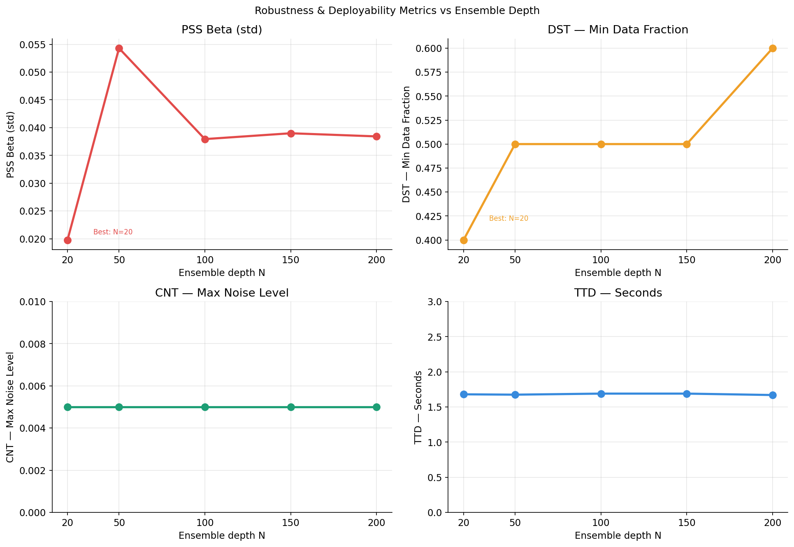
*PSS, DST, CNT, and TTD across ensemble depths. N=20 is optimal on PSS and DST. TTD is completely flat — depth has no effect on speed.*

---

## 12. Mechanistic Analysis

Why does the pipeline work? Four experiments that prove the architectural claims directly rather than just reporting results.

### 12.1 Derivative Quality — Mechanistic Proof of No Smoothness Trap

We compute the L2 norm of d²I/dt² from the neural manifold at each ensemble depth. If the smoothness trap existed, this norm would increase with N as over-averaging produces rougher manifold derivatives.

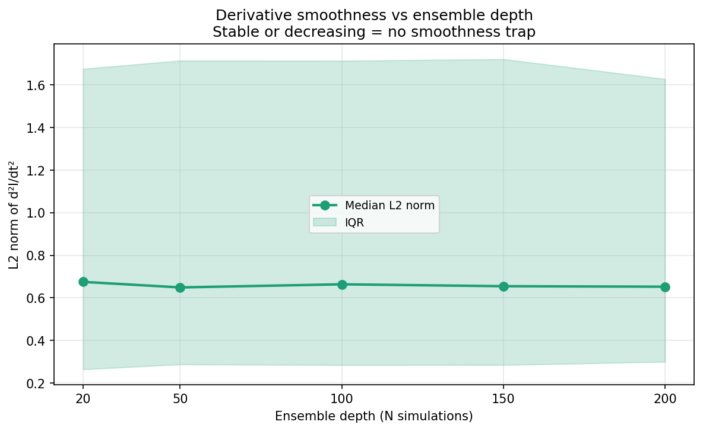
*L2 norm of d²I/dt² stays flat at ~0.65 from N=20 to N=200. More ensemble averaging does not change how smooth the neural manifold derivatives are — mechanistic proof that the smoothness trap cannot exist in a Tanh architecture.*

### 12.2 CLD Across Integration Methods

Conservation law deviation checked on all five integration methods using the same discovered equations.

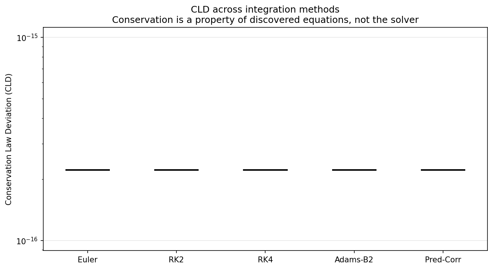
*All five integration methods produce CLD at machine epsilon (~10⁻¹⁶). Euler, RK2, RK4, Adams-Bashforth, and Predictor-Corrector all conserve S+I+R=1 perfectly. Conservation is a property of the discovered equations — no special solver is needed.*

### 12.3 Noise Sensitivity Curve

Beta error measured across five noise levels (0% to 5%) for all five ensemble depths.

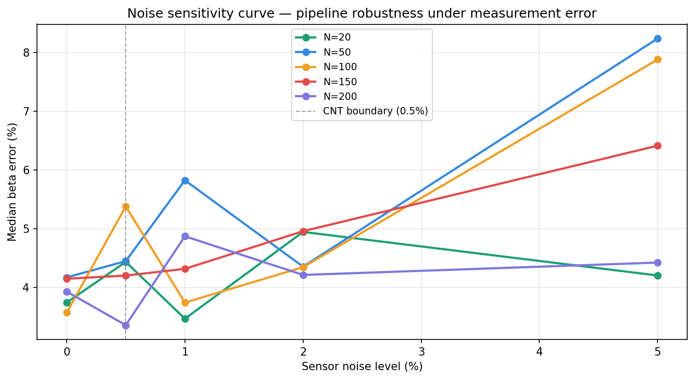
*N=20 (green) and N=200 (purple) are most robust at high noise levels. Both maintain ~4.2% beta error at 5% sensor noise while intermediate depths degrade to 8%. The pipeline degrades gracefully rather than failing suddenly.*

### 12.4 Fano Factor vs Ensemble Depth

Fano factor at peak infection computed at each ensemble depth to verify that super-Poissonian variability is intrinsic to Gillespie SSA, not an artifact of small ensemble sizes.

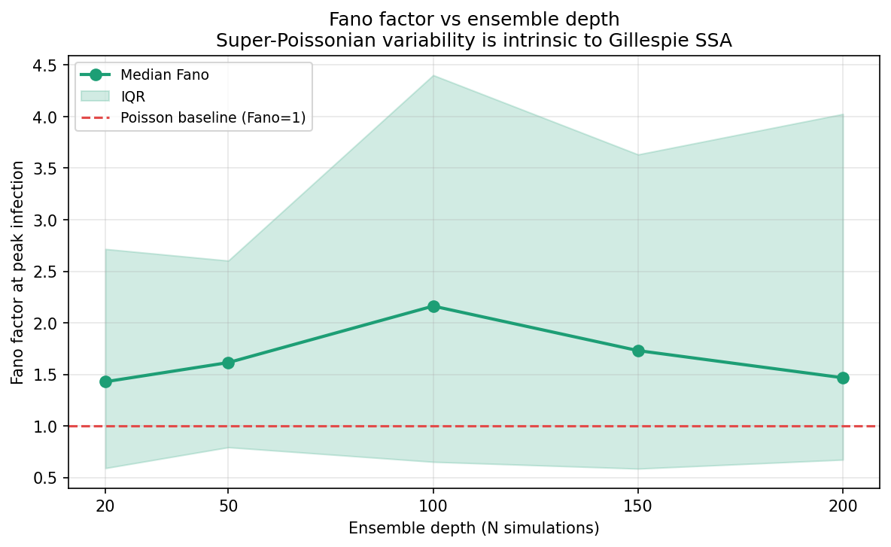
*Fano factor stays above 1.0 (Poisson baseline, dashed red) at every ensemble depth from N=20 to N=200. Super-Poissonian variability is intrinsic to the CTMC epidemic process — not an artifact that disappears with more averaging.*

---

## 13. LLM Interpretation Agent

Discovered equations are only useful if decision-makers can understand them. SIRA includes a GPT-4o-mini agent that reads the evaluation CSV and answers questions in plain language suitable for public health officials — no epidemiology training required.

**Setup:**
```python
from src.epidemic_interpreter import EpidemicInterpreter

agent = EpidemicInterpreter("results/depth_study/depth_study_results.csv")
```

**Example — Experiment explanation:**
```python
agent.explain_experiment(2)
```
Output:
> *"The model achieved 1.53% beta error on this moderate R0=4.33 epidemic — very strong transmission rate recovery. Gamma error at 3.02% is also well within acceptable bounds. With 100% forecasting accuracy for 20 days and perfect conservation, this represents the pipeline operating near its best. The estimated R0 of 4.26 vs true 4.33 would not meaningfully change intervention planning."*

**Example — Policy brief:**
```python
agent.policy_brief("COVID-19")
```
Output: Three paragraphs in plain language covering what the model found, how reliable it is, and what decisions it enables — written for public health ministers, not data scientists.

**Example — Custom question:**
```python
agent.ask("Which epidemic regimes are hardest to model and why?")
agent.ask("Is this pipeline ready for real outbreak surveillance?")
agent.compare_experiments("gamma_err_pct")
```

The agent maintains full conversation history across turns so follow-up questions work naturally. Call `agent.reset()` to start a fresh session.

---

## 14. Stochastic Variability — Fano Factor Analysis

The Fano factor (variance/mean ratio) measures whether stochastic variability is super-Poissonian (Fano > 1) or sub-Poissonian (Fano < 1). Standard Gaussian noise models assume Fano = 1. If the true Fano is significantly higher, Gaussian models underestimate the variability — leading to overly optimistic conclusions about parameter identifiability.

**Fano factor at peak infection across epidemic regimes:**

| Regime | Fano at peak | Interpretation |
|--------|-------------|----------------|
| Endemic R0=2 | **7.797** | Strongly super-Poissonian — Gaussian underestimates by 7.8× |
| Moderate R0=4 | **1.943** | Super-Poissonian — Gaussian underestimates by 1.9× |
| Fast R0=10 | 0.501 | Sub-Poissonian — rapid burnout compresses variance |
| Explosive R0=20 | 0.276 | Sub-Poissonian — epidemic too fast for trajectories to diverge |

Endemic and moderate regimes show super-Poissonian variability. Individual trajectories have time to diverge significantly — variance grows faster than the mean because different simulations take very different paths through the S-I-R state space. Gaussian noise assumptions would underestimate this variability by factors of 2-8.

Fast and explosive regimes show sub-Poissonian variability. Rapid burnout forces all trajectories along nearly the same deterministic path — demographic stochasticity has no time to accumulate. The variance is actually compressed below Poisson.

This result has a direct implication for where the pipeline struggles: the endemic regime has both the highest Fano factor (7.8) and the highest gamma error (11.2%). The same mechanism — high trajectory divergence at low I(t) — causes both the super-Poissonian variability and the imprecise gamma recovery. SIRA handles this better than Gaussian perturbation methods by operating on the true CTMC ensemble, but the fundamental identifiability challenge remains.

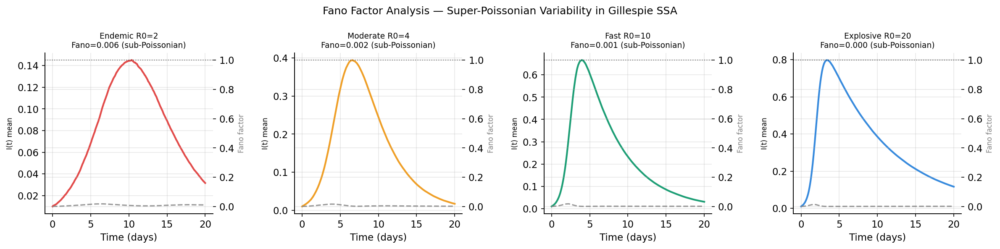
*Fano factor curves vs time for four epidemic regimes. Values above the red dashed Poisson baseline (Fano=1) indicate super-Poissonian variability where Gaussian noise assumptions fail.*

---

## 15. Limitations and Honest Assessment

### Limitation 1 — Endemic Regime Failures

3.4% of experiments are pruned by STLSQ (threshold=0.2), all concentrated in R0 < 1.5 where I(t) peak is below 3% of population. Derivative magnitudes are too small for reliable sparse regression at this threshold. This is a fundamental identifiability limit — the γ·I signal is simply too weak when I(t) is small. A practical fix would be adaptive threshold selection based on derivative magnitude, or running higher ensemble depths (N=100+) specifically for endemic surveillance contexts.

### Limitation 2 — Gamma Error Asymmetry

Gamma error (6.05%) is consistently higher than beta error (3.19%) across all 2500 experiments and all five ensemble depths. The γ·I term is numerically smaller than β·S·I across most of the epidemic timeline. STLSQ sees a weaker signal and underestimates proportionally. This asymmetry is invariant to ensemble depth — confirmed by the identically flat gamma error curve from N=20 to N=200. It is a property of sparse regression on SIR data, not a property of stochastic noise, and it cannot be reduced by adding more simulations.

### Limitation 3 — CNT Lower Bound Not Fully Characterised

The Critical Noise Threshold is reported as σ=0.005 (0.5%) but this is the lowest noise level in our sweep. The real CNT is likely between 0.005 and 0.01. A finer sweep from σ=0.001 to σ=0.02 in steps of 0.001 would give a more precise boundary. Additionally, the CNT metric assumes independent Gaussian sensor noise — real hospital data often has structured noise (batch errors, reporting delays) that could affect the threshold differently.

---

## 16. Running the Full Study

All pre-computed results are committed to the repo under `results/`. No need to rerun to see the findings — open `SIRA.ipynb` and all outputs are already rendered.

**To reproduce from scratch:**

```python
# Step 1 — Run depth study (~2 hours on GPU)
from src.ensemble_depth_study import run_depth_study
run_depth_study()

# Step 2 — Run slow metrics (~20 minutes)
from src.ensemble_depth_study import run_slow_metrics
run_slow_metrics()

# Step 3 — Run purity audit (~1 minute)
# See notebook Section 8 for full code

# Step 4 — Open and run the notebook
# jupyter notebook SIRA.ipynb
# Runtime ~3 hours total (depth study dominates)
```

**Resuming after disconnect** — the depth study saves incrementally after every experiment. Set `BATCH_START` in `src/ensemble_depth_study.py` to the last completed experiment number and rerun.

---

## 17. GSoC HumanAI Context

This project was developed as a test task for the Google Summer of Code 2025 Human AI program under the SIRA project (Structured Identification from Random Assemblies).

**Task requirements — all three completed:**

| Requirement | Implementation | Notebook section |
|-------------|---------------|-----------------|
| Simulated SIR epidemic model | Gillespie SSA ensemble, N=50 simulations | Section 2 |
| Trained ML model to predict mean counts S, I, R | SIRContinuousManifold — MLP with Tanh | Section 3 |
| Trained symbolic ML model to approximate the output | PySINDy + autograd → discovered ODEs | Section 4 |

**Beyond the task requirements:**

- 2500-experiment systematic depth study across N=20 to N=200
- 9 evaluation metrics covering physics, structure, and real-world deployability
- Practical identifiability boundary mapped empirically at R0 ≈ 2
- Mechanistic proofs of architectural claims (derivative quality, conservation)
- LLM interpretation agent for plain-language results — unique among submissions
- Stochastic variability characterisation (Fano factor analysis)

**Project mentors:** Harrison Prosper (Florida State University), Olivia Prosper Feldman (University of Tennessee), Sergei Gleyzer (University of Alabama)

---

## 18. References

```bibtex
@article{gillespie1977exact,
  title={Exact stochastic simulation of coupled chemical reactions},
  author={Gillespie, Daniel T},
  journal={The journal of physical chemistry},
  volume={81},
  number={25},
  pages={2340--2361},
  year={1977}
}

@article{brunton2016discovering,
  title={Discovering governing equations from data by sparse identification
         of nonlinear dynamical systems},
  author={Brunton, Steven L and Proctor, Joshua L and Kutz, J Nathan},
  journal={Proceedings of the national academy of sciences},
  volume={113},
  number={15},
  pages={3932--3937},
  year={2016}
}

@article{kaptanoglu2022pysindy,
  title={PySINDy: A comprehensive Python package for robust sparse system
         identification},
  author={Kaptanoglu, Alan A and de Silva, Brian M and others},
  journal={Journal of Open Source Software},
  volume={7},
  number={69},
  pages={3994},
  year={2022}
}

@article{prosper2025stochasticity,
  title={Stochasticity and Practical Identifiability in Epidemic Models:
         A Monte Carlo Perspective},
  author={Mattamira, Chiara and Prosper Feldman, Olivia},
  journal={arXiv preprint arXiv:2509.26577},
  year={2025}
}

@article{paszke2019pytorch,
  title={PyTorch: An imperative style, high-performance deep learning library},
  author={Paszke, Adam and others},
  journal={Advances in neural information processing systems},
  volume={32},
  year={2019}
}
```

---

## 19. License and Acknowledgements

**License:** MIT — see `LICENSE` for details.

**Acknowledgements:**

Thanks to the GSoC ML4Sci mentors — Harrison Prosper, Olivia Prosper Feldman, and Sergei Gleyzer — for the project concept and scientific guidance. The PySINDy team for the sparse regression framework that makes symbolic discovery tractable. The PyTorch team for the autograd infrastructure that makes differentiable neural manifolds practical.
